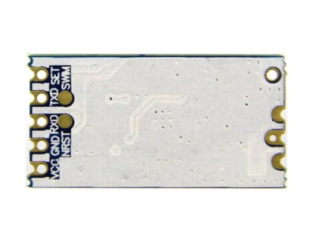
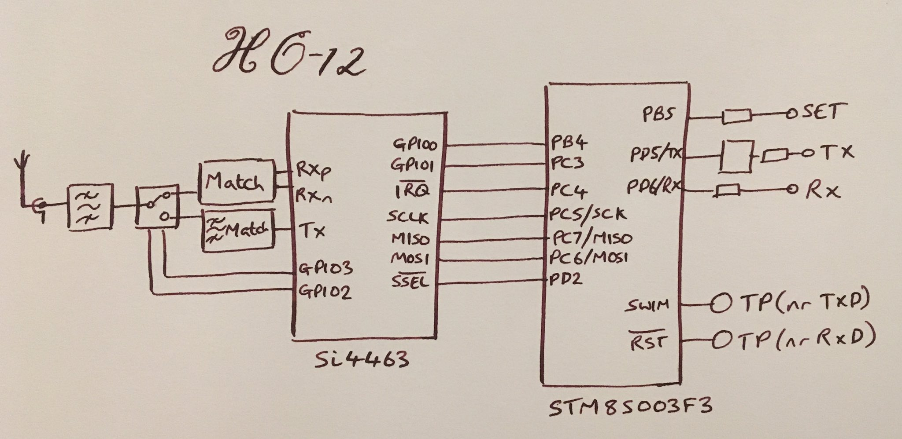
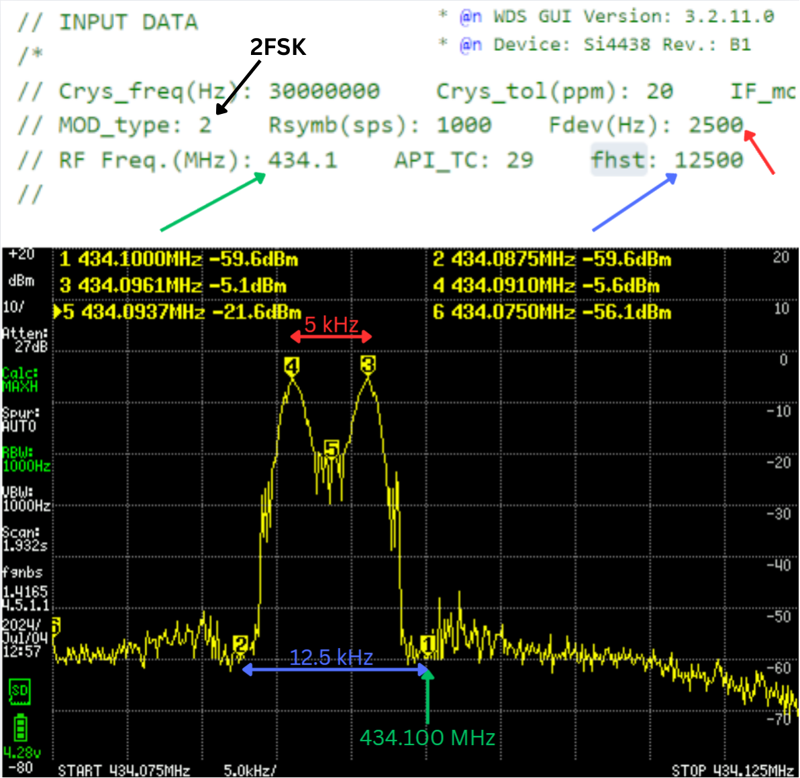

# HC-12 Overview

HC-12 module is a versy simple module. It embedds SI4438 (or SI4464) transceiver chip together with STM8S microcontroller.

The pinout is as on the image below:
   - VCC power supply input
   - GND common ground
   - RXD UART data input
   - TXD UART data output
   - SET Parameter setting control pin
   - NRST programming interface
   - SWM programming interface

It allows reprogramming and communication via serial port. Of course after reprogramming the RXD/TXD/SET pins may serve alternate functions,
as defined in the new firmware.

The simple reversed engineered schematic below:

# HC-12 Reprogramming
The key to the reprogramming is just correct usage of ST-LINK V2 programmer. Here we use the SWIM protocol
where four pins are required during programming: VCC, GND, SWM and RST. VCC and GND are already pinouted
from HC-12, while SWM and RST are available only as a pads on the PCB so you need at least to solder two additional pins
to those pads for easily attaching the programmer.
I will not describe in details on how to program STM8 with ST-LINK V2, as there is a lot of tutorials already available, 
however take a look at [st-link-v2](../st-link-v2/README.md) project to learn about some issues that I've faced during my first experiments with 
HC-12, especially on how to unlock the device in order to flash your own firmware.

# Example source code

# SI4438 Undarstanding RF configuration file part 
Here additional note related to the following settings: frequency, channel width, 2FSK deviation.
The image speeks for itself:

Experiments with the configuration file (radio_config_Si4438.h) generated by **WSD3** sofware shows that
programmed **RF Freq.(MHz)** is the end frequency of the communication channel (it is not the center frequency of the channel!).
This is important to be aware of to correctly match the transmission frequency with the frequency that needs to be entered to the receiver
radio (i.e. Yaesu, Baofen, Qunshen, etc).
Example: if you want to hear the fox on frequency **434.100 MHz** (with the standard FM channel width 12.5kHz), the base **RF Freq.(MHz)** must be set
to **434.10625** and the **fhst** must be set to **12500**.

# SI448 and STM8S Current consumption meassurements:

| Supply voltage [V] | Si4438 state | STM8S state | Current (Tx 10mW) [mA] | Current (Tx 50mW) [mA] | Current (Tx 100mW) [mA] |
|----:|:----:|:----:|:----:|:----:|:----:|
| 3.3 |    Tx |     Run     | 41.2 | 66.8 |    ?   |
| 3.3 | Ready |     Run     |  5.6 |  5.6 |    ?   |
| 3.3 | Sleep |     Run     |  3.5 |  3.5 |    ?   |
| 3.3 | Sleep | Active Halt |  0.2 |  0.2 |    ?   |
| 5.0 |    Tx |     Run     | 41.3 | 67.9 | 109.0* |
| 5.0 | Ready |     Run     |  5.6 |  5.7 |   5.7  |
| 5.0 | Sleep |     Run     |  3.5 |  3.5 |   3.6  |
| 5.0 | Sleep | Active Halt |  0.2 |  0.2 |   0.2  |

*Interesting, the datasheet says that Si4438 in Tx@20dBm takes ~76mA of current.

# SI4438 spectrums
Here examples of spectrum of CW, OOK, 2FSk and 2GFSK
