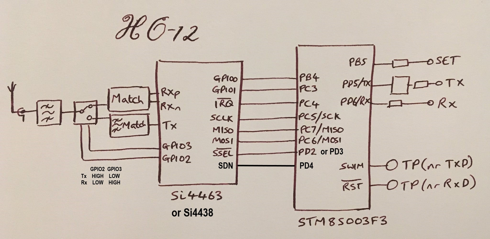

# HC-12 Overview

HC-12 module is a versy simple module. It embedds SI4438 (or SI4464) transceiver chip together with STM8S microcontroller.

The pinout is as on the image below:
   - VCC power supply input
   - GND common ground
   - RXD UART data input
   - TXD UART data output
   - SET Parameter setting control pin
   - NRST programming interface
   - SWM programming interface



It allows reprogramming and communication via serial port. Of course after reprogramming the RXD/TXD/SET pins may serve alternate functions,
as defined in the new firmware.



simple schematic

# HC-12 Reprogramming
Here about how to unlock the brand new HC-12 module

# Example source code

# SI4438 spectrums
Here examples of spectrum of CW, OOK, 2FSk and 2GFSK

# SI4438 Undarstanding RF configuration file part 
Here the image related to the following settings: frequency, channel width, 2FSK deviation

# SI448 and STM8S Current consumption meassurements:

| Supply voltage [V] | Si4438 state | STM8S state | Current (Tx 10mW) [mA] | Current (Tx 50mW) [mA] | Current (Tx 100mW) [mA] |
|----:|:----:|:----:|:----:|:----:|:----:|
| 3.3 |    Tx |     Run     | 41.2 | 66.8 |    ?   |
| 3.3 | Ready |     Run     |  5.6 |  5.6 |    ?   |
| 3.3 | Sleep |     Run     |  3.5 |  3.5 |    ?   |
| 3.3 | Sleep | Active Halt |  0.2 |  0.2 |    ?   |
| 5.0 |    Tx |     Run     | 41.3 | 67.9 | 109.0* |
| 5.0 | Ready |     Run     |  5.6 |  5.7 |   5.7  |
| 5.0 | Sleep |     Run     |  3.5 |  3.5 |   3.6  |
| 5.0 | Sleep | Active Halt |  0.2 |  0.2 |   0.2  |

*Interesting, the datasheet says that Si4438 in Tx@20dBm takes ~76mA of current.
